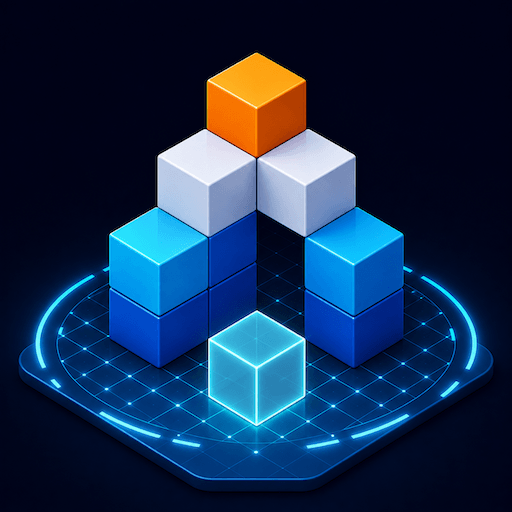
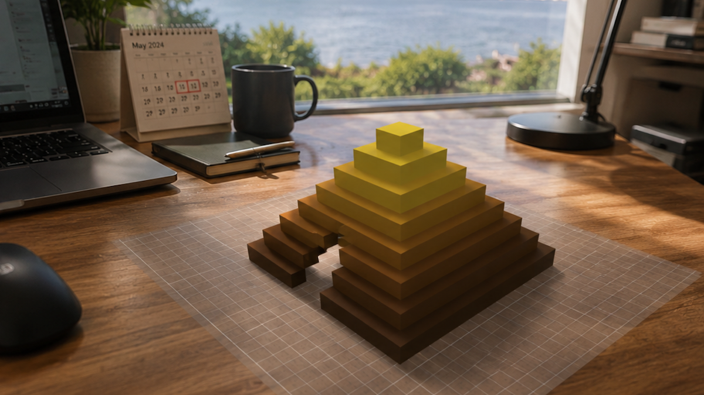

  

<h1 align="center">AR Builder: Pixel Art 3D Voxel</h1>

  Build, edit, and explore colorful 3D voxel creations in Augmented Reality and 3D Mode.

  <strong>AR • Voxel Art • Pixel Art • 3D Modeling • Offline</strong>

---

  

## About

**AR Builder** is a creative voxel and pixel-art app for iPhone and iPad that lets you build colorful 3D models using both **Augmented Reality** and a dedicated **3D editing mode**.

Start with a blank project or choose an editable template, then build your creation cube by cube using flexible tools such as **Pencil**, **Line**, and **Rectangle**.

In **AR Mode**, place your workspace on a real-world surface such as a table or floor, walk around your creation, and edit it naturally from different angles.

Prefer creating without keeping the camera active? Switch to **3D Mode** for a more comfortable building experience while helping reduce battery usage.

## Features

- Build 3D voxel and pixel-art creations
- Create projects from scratch or editable templates
- Build with **Pencil**, **Line**, and **Rectangle**
- Tap or drag with Pencil to place multiple blocks quickly
- Preview lines and rectangular areas before placing blocks
- Use **Layer Build Mode** to lock a specific height
- Remove individual blocks, full lines, or rectangular areas
- Preview blocks before removing multiple cubes
- Undo and Redo changes
- Customize your creations with different colors
- Build directly in the real world with **AR Mode**
- Build without the camera using **3D Mode**
- Walk around and explore creations in 360°
- Move, rotate, and scale projects in AR
- Relocate creations between real-world surfaces
- Measure creations using an **AR ruler**
- Save, load, and manage multiple projects
- Export smooth **360° MP4 videos**
- Export voxel creations as real **3D USDZ models**
- Works fully offline

## AR Mode

AR Mode turns the real world into your creative workspace.

Find a horizontal surface, place the building area, and start creating directly in your surroundings.

You can move around your model freely and view or edit it from different angles while maintaining its position in the real world.

## 3D Mode

3D Mode provides a dedicated environment for building and editing voxel creations without requiring the camera to remain active.

It is useful for longer editing sessions and provides a comfortable way to focus entirely on the model.

## Building Tools

### Pencil

Place individual blocks precisely or drag continuously to build faster.

### Line

Create straight rows of voxel blocks with a preview before placement.

### Rectangle

Quickly create larger rectangular shapes and areas using multiple blocks at once.

### Layer Build Mode

Lock construction to a specific height layer for cleaner and more precise voxel designs.

## Break Tools

Switch to **Break Mode** to edit or remove parts of your creation.

You can:

- Remove individual blocks
- Remove entire lines
- Clear rectangular areas
- Preview multiple blocks before deleting them

## Export

When your creation is complete, you can export it in different formats.

### MP4 Video

Create a smooth 360° rotating video of your voxel model, ready to save or share.

### USDZ

Export your voxel creation as a real 3D **USDZ** model.

USDZ files can be previewed directly on supported Apple devices and used with compatible 3D and AR applications.

## Offline First

AR Builder is designed to work fully offline.

Create, edit, save, and export your voxel projects anytime and anywhere without requiring an internet connection.

## Technology

AR Builder is developed natively for Apple platforms using technologies including:

- Swift
- ARKit
- RealityKit
- iOS / iPadOS

## Platform

- iPhone
- iPad

## Privacy

AR Builder is designed with privacy in mind.

Your projects are created and stored locally on your device. Core building and editing features do not require an internet connection.

---

  Turn the real world into your canvas for 3D voxel pixel art.

